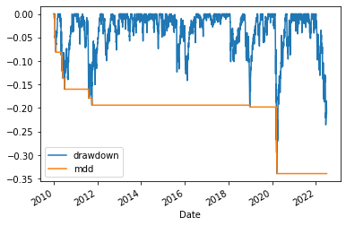
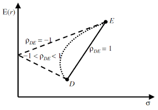
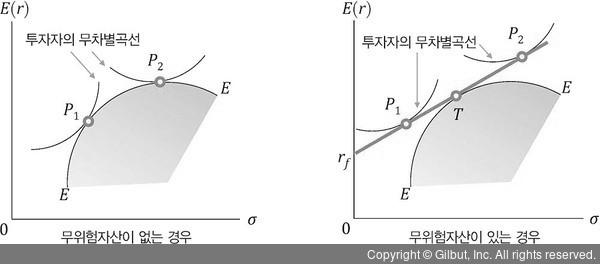
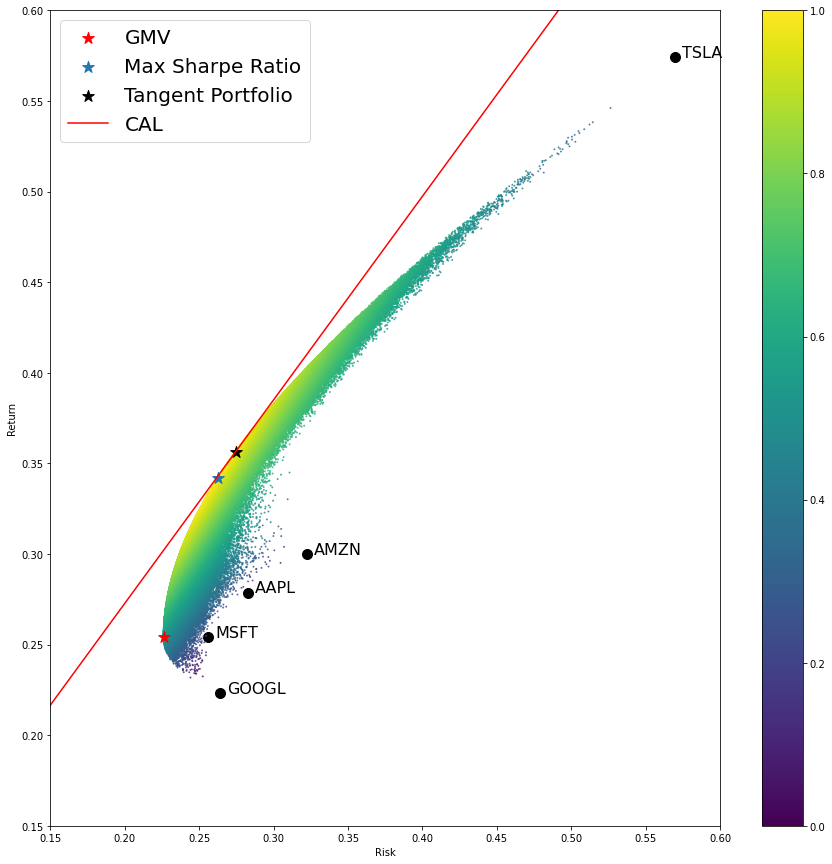
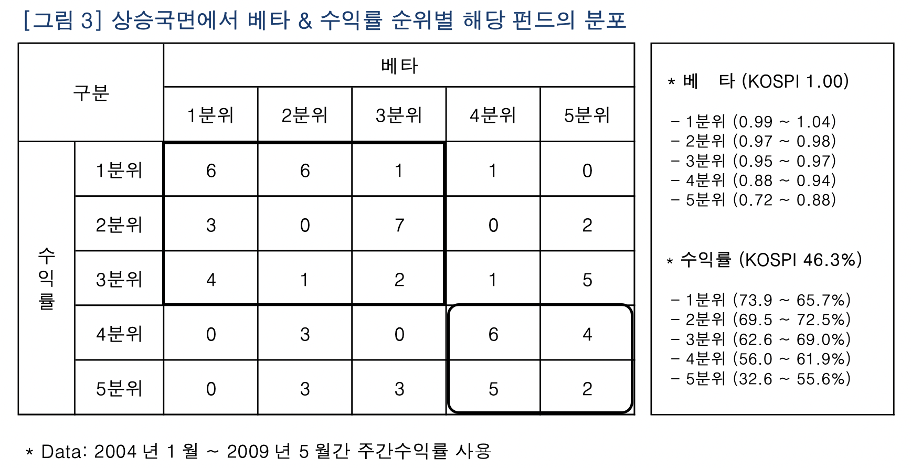
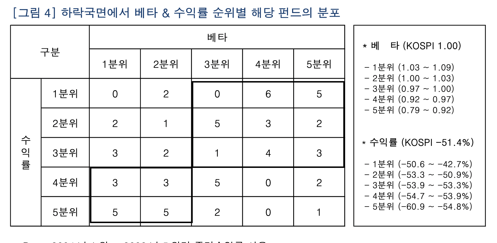
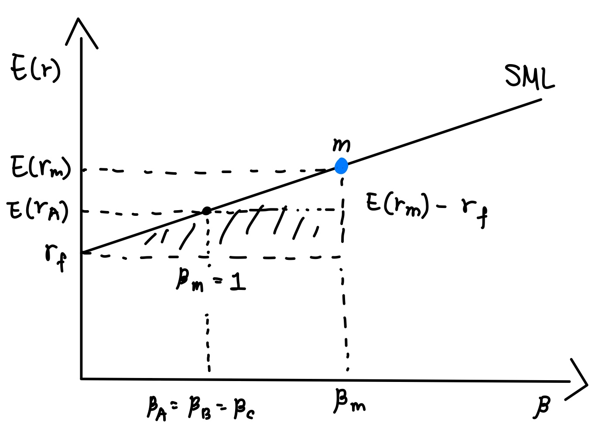

# __Chapter 2 투자와 자산배분__

## __2.1 자산배분과 포트폴리오__

+ 자산배분은 CAPM모델에 기초함. 통계적방법으로 자산을 분류하고 조합해 원하는 목적에 부합한 자산군 생성
+ 목적 : 리스크를 적절히 통제하며 원하는 기대수익을 만족
+ 리밸런싱 : 가격변동에 따라 내재가치 증가시키는 작업, 비중 조절이나 종목교체 발생

## __2.2 포트폴리오 성과 결정요인__

+ 자산배분이 투자전략보다 중요, 총 수익 변동성의 95.6% 설명 (G. Brinson, L. Hood & G. Beebower (1986) Determinants of Portfolio Performance, Financial Analysts Journal)

## __2.3포트폴리오 성과측정 삼총사__

+ __샤프지수(Sharpe Ratio)__
    $$
    Sharpe \ Ratio = \frac{r_p - r_f}{\sigma_p}
    $$
     : 투자수익률 대 변동성 비율, 한 단위의 위험을 부담하는 대신 얻을 수 있는 수익

+ __젠센알파지수(Jensen Alpha)__
    $$
    \alpha = r_p - [r_f + \beta_p(r_m - r_f)]
    $$
    : CAPM 기반의 지수, 값이 클 수록 포트폴리오의 성과가 우수함

+ __트레이너지수(Treynor's Ratio)__
    $$
    T = \frac{r_p - r_f}{\beta_p}
    $$
    : 위험보상비율(reward-to-volatility ratio),위험 한단위 당 얻는 초과수익률, Sharpe ratio와 유사 <br>
	: 위험 : 포트폴리오 베타로 알려진 분산 불가능한 체계적 위험(Systematic Risk) <br><br>
     __샤프지수와 트레이너지수__
    
    + 샤프지수는 분모에 표준편차, 트레이너지수는 베타를 사용하기 때문에 트레이너지수는 '잘 분산된 포트폴리오에 투자하는 경우'에 활용하기 적합
    + 잘 분산된 포트폴리오의 경우 샤프지수와 트레이너지수의 평과결과가 유사하고 잘 분산되지 않은 경우 트레이너지수가 더 높게 나타남. <br>

<br>

+ __정보비율(Information Ratio)__

    : 수익률을 선호하고 위험을 회피한다는 가정하에 위험을 고려해 적극적인 투자성과 평가 <br>
    : 특정한 위험을 부담할 때 반드시 수익으로 연결한다는 직관으로 만들어짐
	
    1. 벤치마크 수익률과 포트폴리오 수익률 간의 차이(Tracking Error) <br>
			: $IR = (r_p - r_m)/{\sigma_p}$ <br><br>
    2. 벤치마크 수익률과 포트폴리오 수익률간의 회귀분석을 활용
			: 젠센알파지수를 회귀식 잔차(Residual : 표본으로 구성한 회귀식과 실제 값의 차이)의 표준편차로 나눠 산출<br>
			: 위험조정 후 수익률을 비체계적 위험으로 나눠 평가<br>
			: $IR = \alpha / \sigma_e$ <br>
            : $ \sigma_e$ : 비체계적 위험

+ __최대낙폭(Maximum Drawdown, MDD)__<br>
	$$
    MDD = \frac{기간중 최저 가치 - 최고가치}{최고가치} \\
    MDD_T = \max_{\tau \in(0, T)}(0, \max_{t \in (0, \tau)}\frac{P_t - P_\tau}{P_t})   
  $$
    : 투자 기간중 포트폴리오의 고점에서 저점까지 최대 누적손실 <br>

## __Python으로 MDD 구현__
```python
import pandas as pd
import numpy as np
import matplotlib.pyplot as plt
%matplotlib inline
try:
    import pandas_datareader as web

except:
    !pip install pandas_datareader
    import pandas_datareader as web
```
```python

def MDD(ticker, startdate, enddate):
    balance = web.get_data_yahoo(ticker, startdate, enddate)['Adj Close'] #원하는 주식을 가져옴
    max_drawdown = [balance[0]] 
    #기간별 최댓값을 구하기 위해 초기값 지정 

    for i in range(1, len(balance)):
        max_drawdown.append(balance[0:i+1].max())
    # 0부터 i기간까지의 최댓값을 list의 i번째 값에 지정
    drawdown, mdd = [], []

    for i in range(len(balance)):
        drawdown.append((balance[i] -max_drawdown[i])/max_drawdown[i])
    #앞서 구한 기간별 최댓값을 활용하여 일별Drawdown 계산 
        mdd.append(min(drawdown))
        #기간내의 Drawdown의 최솟값을 계산 

    df = pd.DataFrame([drawdown, mdd]).transpose()
    df.index = balance.index
    df.columns = ['drawdown', 'mdd']

    return drawdown, mdd, df 

```
```python
drawdown, mdd, df = MDD('^GSPC', '2010-01-02', '2022-06-30')


df.plot()
```
<center>


</center>

```python
MDD = "%0.4f%%" % (min(mdd) *100)

MDD
```
```
'-33.9250%'
```

<br>
<br>

# __Chapter 3 평균-분산 포트폴리오 이론__

__M-V 포트폴리오 가정__

1. 모든 투자자의 기간은 1기간
2. 투자자는 위험을 회피하고 기대효용을 극대화 하려고 함
3. 기대수익률과 표준편차에 따라 투자결정, 지배원리에 따라 투자 대상 선택
4. 거래비용 및 세금 X

## __3.1 포트폴리오의 기대수익률과 위험__
- 마코위츠는 상관계수가 낮은 자산을 결합하여 포트폴리오 구성할 수 있음을 제시
- 최적포트폴리오 : 기대수익률과 리스크 계산 후 무차별곡선(indifference curve)을 이용해 결정

### __3.1.2 n Assets Portfolio__
- 포트폴리오 기대 수익률 : $w_ 1r_1 + \dots +w_nr_n$
- 포트폴리오 기대 수익률(행렬 연산) : <br>
$w = \begin{pmatrix}w_1&  \dots &w_n\\ \end{pmatrix} \\
r = \begin{pmatrix}r_1 & \dots & r_n\\ \end{pmatrix} \\
r_p = w\ \cdot \ r^T  $

- 포트폴리오 리스크 : $\sum{w_i w_j \sigma_{ij}}$
- 포트폴리오 리스크 행렬연산 :<br>
$ w= \begin{pmatrix}w_1&  \dots &w_n\\ \end{pmatrix} \\
 \sigma = \begin{pmatrix}\sigma_{11} & \dots &
\sigma_{1n}
 \\  &\ddots&
 \\\sigma_{n1} & \dots & \sigma_{nn} \end{pmatrix} $
 <br>
 $
 \sigma^2_p = w \cdot \sigma \cdot w^T
 $


## __3.2 최소분산포트폴리오(GMV Portfolio, 2 assets)__
- 두 자산의 움직임 상관계수가 -1에 가까울수록 분산효과가 커짐
- 상관관계, 투자 비중에 따라 다양한 기대수익률과 위험의 조합이 만들어짐
- 최소분산포트폴리오에서 투자비중은 다음과 같은 공식을 통해 구할 수 있음
- $W_A = (\sigma_B^2 - \sigma_{AB})/(\sigma_A^2 + \sigma_B^2 - 2\sigma_{AB}) \\ W_B = 1- W_A$

<center> 



</center>

## __3.3 체계적위험과 비체계적 위험(Systematic Risk, Idiosyncratic Risk)__

- 주가 변동 위험은 모든 기업에 공통적으로 영향을 미치는 요인에 의한 체계적 위험과 개별 기업에 의해 발생하는 비체계적 위험으로 구분됌
- 투자 종목 개수의 증가로 감소시킬 수 있는 정도는 한계가 존재
- __비체계적위험(Unsystematic Risk)__ : 분산투자로 제거 할 수 있는 위험
- __체계적 위험(Systematic Risk)__ : 시장 전체와 관련된 위험으로 경제변수(이자율, 환율, 경기선행지수, 실업률, 경제정책)의 불리한 움직임을 가리킴
- 체계적 위험은 전체변동에 대한 개별종목의 변동 정도로 측정하며, 주식시장 전체 변화율과 개별 종목 변화율 간 회귀분석을 통해 측정할 수 있음(베타)


## __3.4 무위험자산과 최적 자산배분__

### __3.4.1 효율적 포트폴리오(Efficient Portfolio)__
- 여러개의 자산으로 구성된 포트폴리오의 구성비율을 달리하면 다양한 포트폴리오를 구성할 수 있고, 이렇게 연결한 선을 포트폴리오 결합선이라고 함
- 지배원리를 만족시키는 모든 포트폴리오를 “ 효율적투자선 (Efficient Frontier)” 라고 함
- 투자 대상의 비율을 조정하면 무수히 많은 포트폴리오를 구성할 수 있음( 투자기회집합(investment opportunity set)
<center>

</center>

### __3.4.2 기대효용과 무차별 곡선__
- 합리적 투자자라면 불확실한 위험을 피하면서 기대효용을 극대화
- 이런 투자자들의 태도는 convex한 무차별곡선으로 표시
- 투자자의 위험회피적 성향이라는 것을 의미함
- 위험회피도가 클수록 기울기가 더욱 가파른형태가 됌
- 여러개의 무차별 곡선중 위에 있는 곡선이 더 높은 효용을 가짐
<center>

</center>

### __3.4.3 최적 포트폴리오의 선택__
- 최적포트폴리오는 효율적 투자선과 투자자의 무차별곡선이 접하는 점에서 결정됌

### __3.4.4 무위험자산 + 위험자산__

- 무위험자산 : 기대수익률은 $r_f$로 일정하고 분산은 0이며, 다른자산과의 공분산도 0이라고 가정함<br><br>
__자산 i와 무위험자산으로 구성된 포트폴리오__
    - $ E(r_p) = r_f + w(E(r_i) - r_f) $
    - $E(r_p) - r_f$ 
    <br>: 위험 프리미엄  : 무위험 자산에 투자비중만큼의 위험 프리미엄이 더해진 형태<br>
    - 표준편차 : $\sigma_p = w \sigma_i$ 
    - 가중치(자산i) $ w= \sigma_p/\sigma_i$
    - $E(r_p) = \frac{[E(r_pf) -r_f]}{\sigma_i} \sigma_p + r_f$
    - 이는 무위험 자산이 있는 포트폴리오의 기대수익률은 포트폴리오 위험과의 선형관계를 보여줌

### 3.4.5 무위험자산 + 위험자산 + 효율적 투자선
- Efficient Portfolio와 무위험자산의 접선의 교점을 접점포트폴리오라고 하고, 효율적 투자선상의 포트폴리오 중에서 가장 우월한 포트폴리오라고함
- 이떄 이 선은 자본배분선(Capital Allocation Line, CAL)이라고 함. 
- $[E(r_p) -r_f]/ \sigma_p$ : 위험한단위를 부담하는 대신 얻는 수익률, 위험보상 비율

### __3.4.6 최적포트폴리오 선택__
- 투자자가 최적포트폴리오를 선택하는 과정은 두 단계로 나뉨  
    1. 지배원리에 따라 효율적 투자선을 찾아냄
    2. 투자자의 기대효율을 극대화하고자 투자자의 위험회피 성향을 보여주는 무차별곡선과 효율적 투자선이 접하는 최적 포트폴리오 구함 (Portfolio Separation Theorem)


# __GMV Portfolio 구현 (4.3 포트폴리오 최적화)__

```python
import numpy as np
import pandas as pd
import matplotlib.pyplot as plt
%matplotlib inline
try:
    import pandas_datareader as web
    import cvxopt as opt
    from cvxopt import solvers

except:
    !pip install pandas_datareader 
    !pip install cvxopt
    import pandas_datareader as web

```


```python
#GMV Portfolio

ticker = ['AAPL', 'GOOGL', 'MSFT', 'AMZN', 'TSLA']
#포트폴리오 자산으로 애플, 구글, 마이크로소프트, 아마존, 테슬라 설정
start_date = '2010-06-29'
end_date = '2022-06-30'
#시작일 2010-06-29, 종료일 2022-06-30

data = web.get_data_yahoo(ticker, start_date, end_date)['Adj Close'].dropna()

ret = data.pct_change().dropna()
data = data/data.iloc[0] * 100

```


```python
rf = web.get_data_yahoo('TLT', '2010-06-28', '2022-06-30')['Adj Close'].pct_change().dropna()
#무위험자산 수익률로 iShare의 20years+ Treasury bond etf 활용 
rf_rate = rf.mean() * 252
# 1년 수익률을 구하기위해 * 252
```

```python
#Feasible Set
n = len(data.columns)
returns = []
stds = []
wgt = []
count = 1000000

tr = 0
#투자기회집합(Feasible Set)을 구하기 위해 100만회 반복시행 
```


```python
for i in range(count):
    weights = np.random.random(n)
    weights /= sum(weights)
    #랜덤 가중치 설정
    wgt.append(weights)
    mean = np.sum(weights * ret.mean()*252)  
    # *252로 1년 수익률 계산
    var = np.dot(weights.T, np.dot(ret.cov()*252, weights))
    # *252로 1년 분산 계산
    cov = np.sqrt(var)
    returns.append(mean)
    stds.append(cov)
    tr += 1
```

```python
wgt2 = pd.DataFrame(wgt, columns = data.columns)
sharpe = np.array(returns)/np.array(stds)
#랜덤 시행된 각 포트폴리오의 샤프지수 계산
tangent = (np.array(returns)- rf_rate)/np.array(stds)
#CAL을 구하기 위해 각 포트폴리오와 무위험자산의 기울기 계산
dt = {'Returns':returns, 'Stds': stds, 'Sharpe' : sharpe, 'Tangent' : tangent}
dt = pd.DataFrame(dt)

eff = pd.concat([dt,wgt2], axis = 1)
# 앞서 나온결과를 하나의 DataFrame으로 묶기
eff.tail(5)
```

<div>
<style scoped>
    .dataframe tbody tr th:only-of-type {
        vertical-align: middle;
    }

    .dataframe tbody tr th {
        vertical-align: top;
    }

    .dataframe thead th {
        text-align: right;
    }
</style>
<table border="1" class="dataframe">
  <thead>
    <tr style="text-align: right;">
      <th></th>
      <th>Returns</th>
      <th>Stds</th>
      <th>Sharpe</th>
      <th>Tangent</th>
      <th>AAPL</th>
      <th>GOOGL</th>
      <th>MSFT</th>
      <th>AMZN</th>
      <th>TSLA</th>
    </tr>
  </thead>
  <tbody>
    <tr>
      <th>999995</th>
      <td>0.322758</td>
      <td>0.249728</td>
      <td>1.292438</td>
      <td>1.099240</td>
      <td>0.209654</td>
      <td>0.112694</td>
      <td>0.301949</td>
      <td>0.194144</td>
      <td>0.181560</td>
    </tr>
    <tr>
      <th>999996</th>
      <td>0.349222</td>
      <td>0.271425</td>
      <td>1.286625</td>
      <td>1.108871</td>
      <td>0.199134</td>
      <td>0.021144</td>
      <td>0.413922</td>
      <td>0.095539</td>
      <td>0.270261</td>
    </tr>
    <tr>
      <th>999997</th>
      <td>0.389582</td>
      <td>0.319615</td>
      <td>1.218911</td>
      <td>1.067958</td>
      <td>0.160572</td>
      <td>0.277915</td>
      <td>0.002579</td>
      <td>0.141322</td>
      <td>0.417611</td>
    </tr>
    <tr>
      <th>999998</th>
      <td>0.352367</td>
      <td>0.274801</td>
      <td>1.282261</td>
      <td>1.106691</td>
      <td>0.139329</td>
      <td>0.146620</td>
      <td>0.240847</td>
      <td>0.189859</td>
      <td>0.283344</td>
    </tr>
    <tr>
      <th>999999</th>
      <td>0.345859</td>
      <td>0.278388</td>
      <td>1.242363</td>
      <td>1.069055</td>
      <td>0.027270</td>
      <td>0.315447</td>
      <td>0.138150</td>
      <td>0.238066</td>
      <td>0.281067</td>
    </tr>
  </tbody>
</table>
<p>1000000 rows × 9 columns</p>
</div>


```python
spot = pd.concat([ret.mean()*252, ret.std()*np.sqrt(252)], axis =1)
spot.columns = ['mean', 'std']
```

```python
#시각화

mvport = eff.iloc[eff['Stds'].idxmin()]
#100만개의 포트폴리오중 가장 분산이 작은 포트폴리오
mvport2 = eff.iloc[eff['Sharpe'].idxmax()]
#샤프지수가 가장 큰 포트폴리오
mvport3 = eff.iloc[eff['Tangent'].idxmax()]
#무위험자산과의 기울기가 가장 큰 포트폴리오

plt.subplots(figsize= [15,15])
plt.scatter(spot['std'], spot['mean'], marker = 'o', s=100, color = 'k')
#활용된 자산 시각화
for i in range(spot.shape[0]):
    plt.text(x=spot['std'][i]+0.005, y=spot['mean'][i], s = spot.index[i], fontsize =16)
#4개 자산 라벨링

plt.scatter(eff['Stds'], eff['Returns'], marker= 'o', s = 1, alpha =0.7, c = eff['Sharpe'], cmap ='viridis')
#만들어진 포트폴리오 시각화 & 샤프지수에 따라 구분
plt.scatter(mvport[1], mvport[0], color = 'r', marker = '*', s = 150, label ="GMV")
#GMV 포트폴리오 시각화
plt.scatter(mvport2[1], mvport2[0], marker = '*', s = 150, label ="Max Sharpe Ratio")
#최대 샤프지수 포트폴리오 시각화
plt.scatter(mvport3[1], mvport3[0], color = 'k', marker = '*', s = 150, label = "Tangent Portfolio")
#탄젠트 포트로리오 시각화
plt.scatter(0, rf_rate, color = 'k',marker = 's', s = 150)
#무위험자산 시각화

plt.plot([0, 2* mvport3[1],], [rf_rate, 2*mvport3[0]-rf_rate], color = 'red', label = 'CAL')
#CAL 직선 시각화 

plt.colorbar()
plt.xlim(0.15,0.6)
plt.ylim(0.15,0.6)
plt.xlabel('Risk')
plt.ylabel("Return")
plt.legend(loc=2, fontsize = 20)
plt.show
```

    



```python
try :
    from scipy import optimize as op
except :
    ! pip install scipy
    from scipy import optimize as op

#GMV Portfolio 계산
def gmv(x):
    return (np.dot(x.T, np.dot(ret.cov()* 252, x)))
    #GMV 포트폴리오의 목적함수 분산의 최소화

def gmvportfolio(x):
    x0 = [1/len(x.columns) for i in range(len(x.columns))]
    #초기 가중치 1/n으로 설정
    constraints = ({'type': 'eq', 'fun': lambda x: np.sum(x) - 1}, )  
    #가중치의 합= 1
    bound = (0.0001, 1.0)
    #각 자산의 하한선,상한선 (0.0001로 한 이유는 테슬라의 자산을 포함시키기 위함)
    bounds =tuple(bound for i in range(len(x.columns))) 
    #Long only
    options = {'ftol' : 1e-20, }

    sol = op.minimize(gmv, x0, constraints = constraints, 
                    bounds = bounds, options = options, method='SLSQP',)
    return sol

```


```python

gmv_wgt =gmvportfolio(ret).x.transpose()
#gmv 포트폴리오의 분산
gmv_ret = np.sum(ret.mean() * gmv_wgt * 252)
#gmv 포트폴리오의 1년수익률
gmv_std = np.sqrt(gmvportfolio(ret).fun)
#gmv 포트폴리오의 표준편차

gmv_wgt2 = pd.DataFrame(gmv_wgt).T
gmv_wgt2.columns = ret.columns
dt2 = {"Returns" : gmv_ret, 'Stds' : gmv_std}
dt2 = pd.DataFrame(dt2, index = [0])

eff2 = pd.concat([dt2, gmv_wgt2], axis =1)

eff2.T


```

```python
mvport = pd.DataFrame(mvport)

compare = pd.concat([eff2.T, mvport], axis = 1)
compare.columns = ['Opt', 'Trial']
#무작위 시행과 최적화 프로그램 비교
compare
```


<div>
<style scoped>
    .dataframe tbody tr th:only-of-type {
        vertical-align: middle;
    }

    .dataframe tbody tr th {
        vertical-align: top;
    }

    .dataframe thead th {
        text-align: right;
    }
</style>
<table border="1" class="dataframe">
  <thead>
    <tr style="text-align: right;">
      <th></th>
      <th>Opt</th>
      <th>Trial</th>
    </tr>
  </thead>
  <tbody>
    <tr>
      <th>Returns</th>
      <td>0.25460</td>
      <td>0.25523</td>
    </tr>
    <tr>
      <th>Stds</th>
      <td>0.22598</td>
      <td>0.22601</td>
    </tr>
    <tr>
      <th>AAPL</th>
      <td>0.24666</td>
      <td>0.24161</td>
    </tr>
    <tr>
      <th>GOOGL</th>
      <td>0.30547</td>
      <td>0.29364</td>
    </tr>
    <tr>
      <th>MSFT</th>
      <td>0.36320</td>
      <td>0.37389</td>
    </tr>
    <tr>
      <th>AMZN</th>
      <td>0.08457</td>
      <td>0.09033</td>
    </tr>
    <tr>
      <th>TSLA</th>
      <td>0.00010</td>
      <td>0.00051</td>
    </tr>
  </tbody>
</table>
</div>

# __Chapter4 자본자산가격결정모델(CAPM)__

## __4.1 기본가정__

- 투자 효용을 최대화하고 싶은 위험회피 투자자는 M-V를 기준으로 포트폴리오를 선택
- 증권시장은 완전경쟁, 증권의 공급 고정, 거래비용& 세금 X, 공매도 제한 X, 시장정보 자유롭게 전달
- 모든 투자자는 기대수익률, 분산, 공분산에 대해 같은 기대
- 무위험자산 존재, 모든 투자자가 얼마든지 자금 차입 가능
<br>
<br>
### __4.1.1 동일한 기대와 시장포트폴리오, 그리고 자본시장선__
- CML(Capltial Market Line) : 시장포트폴리오를 무위험자산의 투자배분을 통해 나온 자본배분선
- CML과 CAL의 차이 <br>
	: CAL은 투자자를 위한 무위험 자산 및 위험 포트폴리오의 할당을 구성함.C ML은 위험 포트폴리오가 시장포트폴리오인 특별한 경우
- 자본시장선은 기대수익률과 위험과의 관계를 보여줌, $Risk \ Premium = (E(r_m)-r_f)/\sigma_m * \sigma_p$ 여기서 기울기는 위험에 대한 시장가격으로 위험보상비율이라고 함
	
  __CML__
  $$
  R_p = r_f + \frac{r_m -r_f}{\sigma_m}\sigma_p
  $$


### __4.1.2 포트폴리오 베타__
- 개별자산 또는 포트폴리오 시장위험이나 체계적 위험을 측정
- CAPM은 체계적 위험만이 기대수익률이라는 보상을 받음
- 시장수익률이 1%p 변할 때 종목수익률이 몇 %p 변하는지 의미
- 베타가 1보다 작으면 시장의 움직임에 둔감하고
- 베타가 1보다 크면 시장의 움직임에 민감하게 반응
- “국면이 전환됨에 따라 고,저베타 투자비중 변경”
- $ \bar r_p = r_f + \beta(E(r_m)- r_f) $
- $ \beta = \sigma_{i,m}/(\sigma_m)^2 $


### __베타의 활용과 문제점(미래에셋 자산운용)__
2. 베타의 활용 방법
  - 초과수익이나 위험의 축소를 원할 때 포트폴리오의 베타를 조정
  - 시장의 상승을 기대할 때 포트폴리오의 베타 높게 조정, 시장의 하락이 우려될 때 베타를 낮게 조정

  <center>
  
  

  </center>


## __포트폴리오 베타 예시__

```python
# 깃허브(github.com)에 저장된 portfolioAB.csv를 읽어 오는 방법
# url은 저자의 깃허브에 저장된 portfolioAB.csv이다

import pandas as pd

url ='https://raw.githubusercontent.com/jimsjoo/gilbut_portfolio/master/portfolioAB.csv'

df = pd.read_csv(url)
df.head()
```
Date 	KOSPI 200  Portfolio A	Portfolio B <br>
0 	2014-04-08	1993.03		1058.29		1008.29 <br>
1	2014-04-09	1998.95		1058.77		1008.85<br>
2	2014-04-10	2008.61		1059.77		1010.05<br>
3	2014-04-11	1997.44		1058.78		1008.86<br>
4	2014-04-12	1997.44		1060.70		1010.96<br>

```python

# 앞서 읽어 들인 포트폴리오 수익률의 변동성, 공분산, 베타를 계산한다
import math

# 일간 수익률에 sqrt(250)을 곱해 연율화
vol_m = returns['KOSPI'].std() * math.sqrt(250)
vol_A = returns['PortA'].std() * math.sqrt(250)

# 'KOSPI', 'PortA', 'PortB'의 수익률(일간)을 계산한다
returns = df[['KOSPI', 'PortA', 'PortB']].pct_change()
```

```python

vol_B = returns['PortB'].std() * math.sqrt(250)

# 변동성 출력
print('KOSPI200 일간변동성: {:0.2%}'.format(vol_m))
print('Portfolio A 일간변동성: {:0.2%}'.format(vol_A))
print('Portfolio B 일간변동성: {:0.2%}'.format(vol_B))

# 포트폴리오 수익률 공분산 계산
covs = returns.cov()
cov_mA = covs.loc['KOSPI', 'PortA']
cov_mB = covs.loc['KOSPI', 'PortB']

# 시장 포트폴리오, KOSPI 수익률 분산 계산
var_m = returns['KOSPI'].var()

# 베타 계산
beta_A = cov_mA / var_m
beta_B = cov_mB / var_m
print('Portfolio A의 beta: {:.4f}'.format(beta_A))
print('Portfolio B의 beta: {:.4f}'.format(beta_B))
```
KOSPI200 일간변동성: 9.83% <br>
Portfolio A 일간변동성: 4.15% <br>
Portfolio B 일간변동성: 4.76%<br>
Portfolio A의 beta: 0.0154<br>
Portfolio B의 beta: 0.0186<br>


## __4.2 증권시장선과 자본시장선__ 

- 특정 자산에 대한 초과수요나 초과공급이 없는 균형 상태에서 체계적 위험인 베타와 기대수익률 사이의 관계를 나타냄
- $E(r_i) = r_f + \beta_i [E(r_m)- r_f]]$
- 증권의 기대수익률은 베타가 결정함, 기대수익률과 베타는 선형관계

### __4.2.1 증권시장선과 자본시장선__
- __증권시장선__ : 시장에서 거래되는 모든 자산에 대해 균형 상태에서 위험과 수익률간의 관계를 설명.
<br>$E(r_i) = r_f + (E(r_m) -r_f)\beta_i$


- SML이 균형 상태일 때 베타와 기대수익률간의 관계를 보여줌
- SML 위에 있는 자산은 높은 기대 수익률 => 현재 주가는 낮게 평가됌 (저평가주 ,매입 수요가 늘어남)
- SML 아래에 있는 자산은 낮은 기대 수익률 => 과대평가된 상태 (초과공급으로 인한 기대수익률 증가)
- 시장P가 효율적이면 기대수익률과 베타계수 사이에 비례관계가 성립


### __4.2.2 위험프리미엄__
- 시장위험프리미엄 = 시장기대수익률 - 무위험수익률


